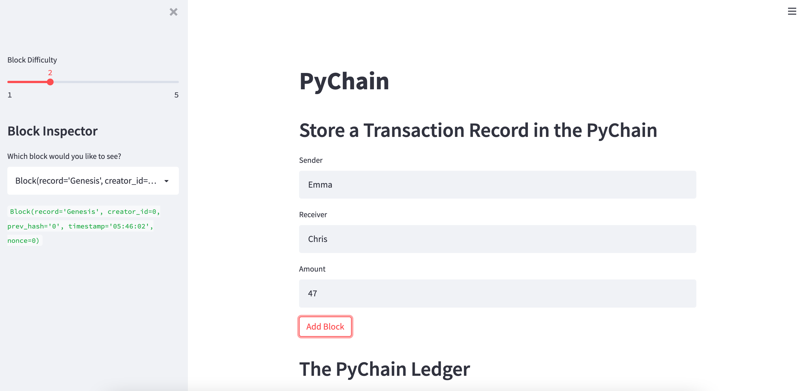
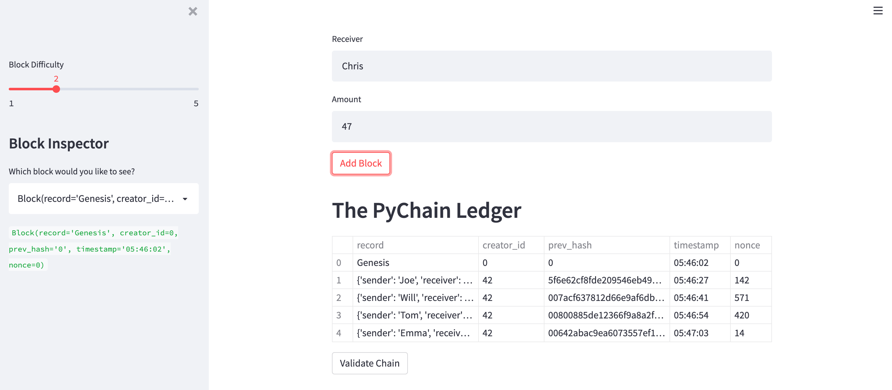
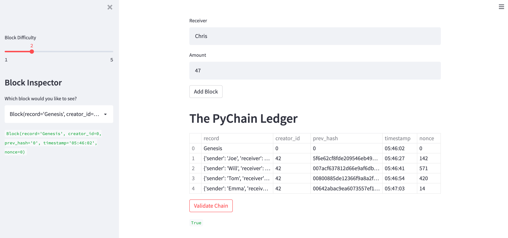
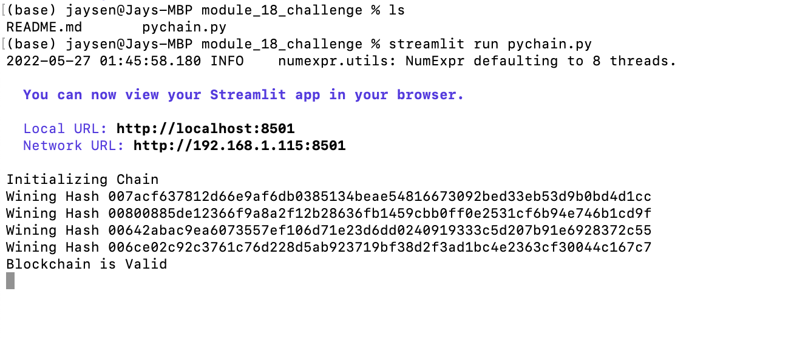

# Module_18_Challenge

## Explanation

This application is a blockchain-based ledger system, complete with a user-friendly web interface. This ledger should allow partner banks to conduct financial transactions (that is, to transfer money between senders and receivers) and to verify the integrity of the data in the ledger. Furthermore, the application generates a fixed-length hash key which can be validated as "True".

## Screenshots

Test data inputs:

Test data added to blockchain:

Blockchain validation:

Terminal output of unique hash values:
